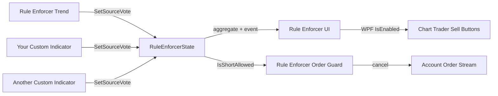

# NT8 Rule Enforcer

A NinjaTrader 8 add-on suite that helps prevent short entries during intraday uptrends. It combines a shared state layer, a trend detector tuned for 3-minute charts, Chart Trader UI controls, and an order guard for enforcement beyond greyed-out buttons.

## Components

| File | Type | Purpose |
|------|------|---------|
| `Custom/AddOns/RuleEnforcerState.cs` | Shared static class | Publishes per-instrument short permission state |
| `Custom/Indicators/RuleEnforcerTrend.cs` | Indicator | Detects uptrend and updates shared state |
| `Custom/Indicators/RuleEnforcerUI.cs` | Indicator | Disables Chart Trader sell buttons when shorts are blocked |
| `Custom/AddOns/RuleEnforcerOrderGuard.cs` | AddOn | Cancels blocked short-entry orders at the account level |

## Installation

### 1. Copy files into NinjaTrader

Copy the contents of this repository's `Custom` folder into your NinjaTrader custom scripts directory:

```
Documents\NinjaTrader 8\bin\Custom\
```

Merge into the existing folders:

- `Custom\AddOns\` → `Documents\NinjaTrader 8\bin\Custom\AddOns\`
- `Custom\Indicators\` → `Documents\NinjaTrader 8\bin\Custom\Indicators\`

### 2. Compile

1. Open NinjaTrader 8
2. Go to **New → NinjaScript Editor**
3. Press **F5** (or right-click any script → **Compile**)
4. Confirm there are no compile errors in the Output window

The **Rule Enforcer Order Guard** AddOn loads automatically after a successful compile. No chart attachment is required.

### 3. Configure a chart

On each 3-minute (or other intraday) chart you want protected:

1. Enable **Chart Trader** on the chart
2. Add **Rule Enforcer Trend** (detects uptrend)
3. Add **Rule Enforcer UI** (greys out sell buttons)

Both indicators must be on the same chart as Chart Trader.

### 4. Verify it is working

- During an uptrend, Chart Trader sell buttons should be greyed out
- The chart label should show `Shorts: BLOCKED (21 EMA + VWAP uptrend)`
- Attempting a short entry should produce a cancellation message in the **Output** window from the Order Guard

## Theory of Operation

### Overview

NT8 does not provide a built-in message bus to Chart Trader. This suite uses a **shared static state class** that acts as the signal layer between independent NinjaScript components running in the same NinjaTrader process.



### 1. Shared state (`RuleEnforcerState`)

`RuleEnforcerState` is a static class keyed by **instrument full name** (for example, `ES 06-26`). Multiple indicators can register independent **votes** per instrument. The UI and order guard read the **aggregated** result.

**Voting rule:** shorts are allowed only when **every** registered source allows shorts. If **any** source blocks, shorts are blocked.

| API | Purpose |
|-----|---------|
| `SetSourceVote(instrument, sourceId, shortAllowed)` | Register or update one indicator's vote |
| `RemoveSource(instrument, sourceId)` | Remove vote when indicator is removed from chart |
| `IsShortAllowed(instrument)` | Read aggregated permission (used by UI + order guard) |
| `GetBlockingSources(instrument)` | Returns names of sources currently blocking shorts |
| `ShortAllowedChanged` event | Fires when the aggregated result changes |

Example with three voters on `ES 06-26`:

```
RuleEnforcerTrend     → block   (shortAllowed = false)
HigherTfFilter        → allow   (shortAllowed = true)
DeltaStructureFilter  → block   (shortAllowed = false)

Aggregate: BLOCKED
```

If no votes are registered for an instrument, shorts are **allowed** by default.

### 2. Trend detection (`RuleEnforcerTrend`)

Designed for **3-minute intraday** trading. An uptrend is defined as all of the following on bar close:

1. **Close > EMA(21)** — price above a fast intraday trend line (~63 minutes of 3-minute bars)
2. **Rising EMA** — the EMA must slope upward (`EMA[0] > EMA[1]`)
3. **Close > session VWAP** — price above the volume-weighted average price for the current session (optional, enabled by default)

When all conditions are true, the market is treated as an uptrend and **shorts are blocked**. If any condition fails, shorts are allowed again.

Session VWAP is calculated inline and resets on each new session bar (`Bars.IsFirstBarOfSession`), respecting the chart's trading hours template.

### 3. Chart Trader UI (`RuleEnforcerUI`)

This indicator does not place orders. It listens to `RuleEnforcerState` and manipulates the Chart Trader WPF controls on the UI thread via `ChartControl.Dispatcher`.

Sell buttons are located by NinjaTrader AutomationId:

- `ChartTraderControlQuickSellMarketButton`
- `ChartTraderControlQuickSellLimitButton`
- `ChartTraderControlQuickSellStopMarketButton`
- `ChartTraderControlQuickSellStopLimitButton`

When shorts are blocked, `IsEnabled = false` is set on each found button, which greys them out. When the indicator is removed, buttons are re-enabled.

### 4. Order guard (`RuleEnforcerOrderGuard`)

Greyed-out buttons are a visual deterrent, not a hard lock. Traders can still attempt shorts through SuperDOM, order entry windows, or other paths.

The AddOn subscribes to `Account.OrderUpdate` for all accounts. When an order reaches `OrderState.Initialized` and shorts are blocked for that instrument, it cancels:

- All `SellShort` orders
- `Sell` orders submitted from a flat position (Chart Trader sometimes uses `Sell` instead of `SellShort`)

Closing a long position with a `Sell` order is still permitted.

### Defense in depth

| Layer | What it does | What it does not do |
|-------|----------------|---------------------|
| UI enforcer | Greys out Chart Trader sell buttons | Block SuperDOM or other entry windows |
| Order guard | Cancels blocked short orders at submission | Guarantee protection against all broker/API paths |
| Trend filter | Defines when rules apply | Predict future price direction |

Together, these layers provide both **visible feedback** and **practical enforcement** for manual Chart Trader workflows.

## Default parameters (3-minute intraday)

| Parameter | Default | Notes |
|-----------|---------|-------|
| EMA Period | 21 | ~1 hour of 3-minute bars |
| Require Rising EMA | true | Prevents blocking shorts on a flat/slipping EMA |
| Use VWAP Filter | true | Requires price above session VWAP |
| Show EMA | true | Displays the 21 EMA on chart |
| Show Status Label | true | Top-right block/allow label |

## Adding votes from your own indicators

**For Grok / AI-assisted integration:** share this file with other sessions:

- [`examples/GROK-ADD-VOTING-TO-INDICATOR.md`](examples/GROK-ADD-VOTING-TO-INDICATOR.md) — full instructions to paste into Grok
- [`examples/RuleEnforcerVoterTemplate.cs`](examples/RuleEnforcerVoterTemplate.cs) — copy-paste code template

Any custom indicator (or strategy) can participate in the voting layer. Each indicator must use a **unique `sourceId`** string so votes do not overwrite each other.

### Step 1: Add the using directive

```csharp
using NinjaTrader.Custom.RuleEnforcer;
```

Ensure `RuleEnforcerState.cs` is in `Documents\NinjaTrader 8\bin\Custom\AddOns\` and compiles successfully.

### Step 2: Define a unique source id

Use a constant that identifies your indicator. The class name is a good default:

```csharp
private const string VoteSourceId = "MyHigherTfFilter";
```

### Step 3: Vote in `OnBarUpdate` (or `OnEachTick`)

`shortAllowed = true` means this source **permits** shorts.  
`shortAllowed = false` means this source **blocks** shorts.

```csharp
protected override void OnBarUpdate()
{
    if (CurrentBar < 20)
        return;

    bool shortAllowed = Close[0] < SMA(50)[0];   // example: block shorts above 50 SMA

    RuleEnforcerState.SetSourceVote(Instrument.FullName, VoteSourceId, shortAllowed);
}
```

Only call `SetSourceVote` when your logic changes if you want to reduce overhead, but calling every bar is fine.

### Step 4: Remove your vote in `State.Terminated`

This is important. When you remove the indicator from a chart, its vote must be withdrawn:

```csharp
protected override void OnStateChange()
{
    if (State == State.SetDefaults)
    {
        // ...
    }
    else if (State == State.Terminated)
    {
        RuleEnforcerState.RemoveSource(Instrument.FullName, VoteSourceId);
    }
}
```

### Full minimal example

```csharp
#region Using declarations
using NinjaTrader.Custom.RuleEnforcer;
using NinjaTrader.NinjaScript;
using NinjaTrader.NinjaScript.Indicators;
#endregion

namespace NinjaTrader.NinjaScript.Indicators
{
    public class MyShortBlockVoter : Indicator
    {
        private const string VoteSourceId = "MyShortBlockVoter";
        private SMA sma50;
        private bool lastVote = true;

        protected override void OnStateChange()
        {
            if (State == State.SetDefaults)
            {
                Name = "My Short Block Voter";
                Calculate = Calculate.OnBarClose;
            }
            else if (State == State.DataLoaded)
            {
                sma50 = SMA(50);
            }
            else if (State == State.Terminated)
            {
                RuleEnforcerState.RemoveSource(Instrument.FullName, VoteSourceId);
            }
        }

        protected override void OnBarUpdate()
        {
            if (CurrentBar < 50)
                return;

            bool shortAllowed = Close[0] < sma50[0];

            if (shortAllowed != lastVote)
            {
                lastVote = shortAllowed;
                RuleEnforcerState.SetSourceVote(Instrument.FullName, VoteSourceId, shortAllowed);
            }
        }
    }
}
```

### Rules of thumb

1. **One source id per indicator type** — do not reuse another indicator's id.
2. **Always call `RemoveSource` in `Terminated`** — otherwise ghost votes keep blocking shorts after you remove the indicator.
3. **Same instrument, multiple charts** — votes are shared by `Instrument.FullName`. Two charts of ES use the same vote pool.
4. **UI and order guard unchanged** — your indicator only votes; `RuleEnforcerUI` and `RuleEnforcerOrderGuard` read the aggregate automatically.
5. **Debugging** — call `RuleEnforcerState.GetBlockingSources(Instrument.FullName)` to see which sources are blocking. The **Rule Enforcer Trend** status label also lists active blockers.

### Bypass note

Removing **any** blocking voter from the chart withdraws that vote. Removing **all** voters (including **Rule Enforcer Trend**) clears the block for that instrument. The order guard only enforces while at least one source is actively voting to block.

## Tuning

All trend logic is configurable in the **Rule Enforcer Trend** indicator properties:

- **Faster response** — reduce EMA Period (e.g. 13)
- **Slower / smoother** — increase EMA Period (e.g. 34)
- **EMA only** — disable **Use VWAP Filter**
- **Less strict** — disable **Require Rising EMA**

## Requirements

- NinjaTrader 8
- Chart Trader enabled on protected charts
- Both **Rule Enforcer Trend** and **Rule Enforcer UI** on each protected chart

## License

Use and modify as needed for personal trading workflows.